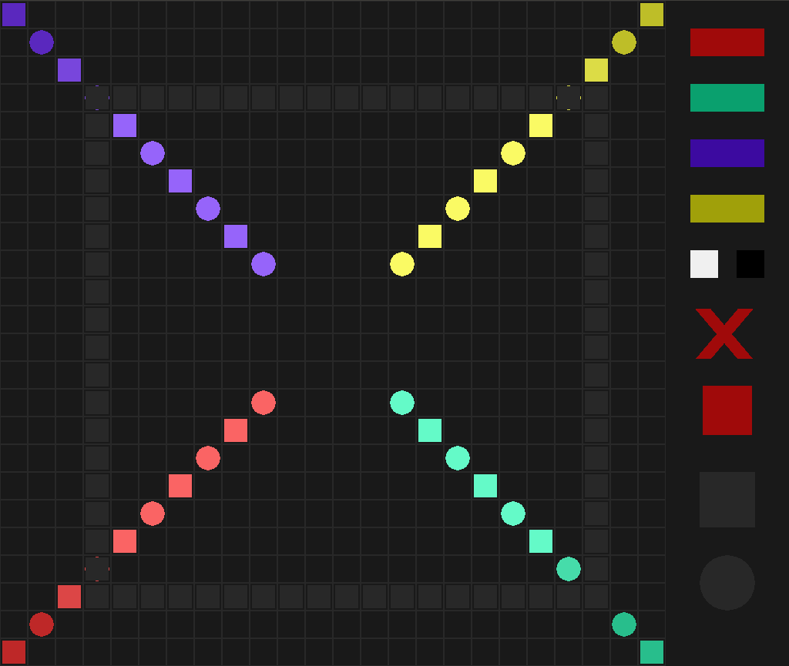

# Radial Synth

This is the homepage for the Olin Spring 2018 Software Design Interactive Programming project as done by Jane Sieving and Lydia Hodges.

## Overview

We created a [program](radialsynth.py) that allows a user to 'draw' on a grid with different shapes and colors, and then play [sound](sound_files/) based on what they have 'drawn'.

## Results

We successfully created a screen that the user can interact with using their mouse. On the left hand side, taking up the majority of the screen, is a grid where the user can click to place different shapes of varying color and hue. On the right hand side, there are buttons that can be clicked on for different affects:
- Color buttons (red, green, blue, yellow): changes the mark that will be placed on the grid to the corresponding color
- Hue buttons (black and white): changes the intensity/brightness of the color of the mark that will be placed on the grid
- Clear button (X): clears all marks on the grid
- Play/Stop button (green triangle/red square): Changes cursor function so that clicking on grid plays sound, clicking while in play-mode will stop playing sound and allow user to place markers on grid again
- Shape buttons (circle and square): changes the mark that will be placed on the grid to the corresponding shape

*The initial screen, clean of marks, with the grid and buttons.*

*The screen with marks, no sound currently playing*

We have also successfully integrated sound playback. After placing marks in the grid, the user clicks on the Play Button to change the cursor function, then clicks anywhere in the grid they want. The program looks at the grid spaces around where the user clicked in rings of increasing size, and plays a corresponding sound for each mark that lies on the current ring. Color determines instrument, hue determines note/pitch, and shape determines whether the note is short or sustained.

*The screen with marks, currently playing sound. Light gray 'ring' is the ring currently playing sound.*

## Implementation

We took the approach of creating multiple of our own classes in Python:

*Our UML Class Diagram*

The classes we created and used are:
- Grid: initialize screen, initialize objects using other custom classes, draw grid, buttons, and markers, implement main loop that runs everything.
- Block: creates a marker to be placed on the grid, defines the attributes of the marker that makes it a note
- Cell: creates a cell in the grid where a marker (Block) can be placed
- Button: creates a button based on the given attributes
- Sweeper: creates the rings, stores the blocks, translates blocks to notes, and plays sound based on the note attributes

We used `Pygame` to create the screen as well as to create the grid, markers, buttons, and rings, and to allow for user interaction through the mouse. We then used `fluidsynth` to play sound from some .sf2 files we have in a folder and loaded in.

The code that actually runs the program is defined in the `Grid` class as a function called `main_loop`. This initializes a number of variables so that the user can start interacting with the grid immediately, without having to click on a button, and then starts updating the screen. In the update loop, the program checks the mouse position and whether or not a button is being pressed; if the mouse is over a button, the click causes a change to some variables as defined by the update loop (the update loop is where the function of each button is programmed), and if the mouse is over the grid, the click either places a marker based on the current values of the variables or begins to sweep rings and play sound.

When it came to designing the program, we had to deviate slightly from our original goal. Originally, the user would have been able to interact with each pixel on the screen, so that they could create actual drawings. However, that was a bit beyond the scope of our two week project, so we opted to create a grid and have the user interact with each cell of the grid instead. This limits the extent to which the user can actually 'draw', but it was a lot easier for us to code, so we could focus on other parts of the program and not just the basic drawing function.

## Reflection
